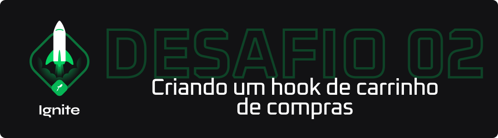

<p align="center">
  
</p>

## 💻 Detalhes do Desafio

Nesse desafio, você deverá criar uma aplicação para treinar o que aprendeu até agora no ReactJS

Essa será uma aplicação onde o seu principal objetivo é criar um hook de carrinho de compras. Você terá acesso a duas páginas, um componente e um hook para implementar as funcionalidades pedidas nesse desafio:

- Adicionar um novo produto ao carrinho
- Remover um produto do carrinho
- Alterar a quantidade de um produto no carrinho
- Cálculo dos preços sub-total e total do carrinho
- Validação de estoque
- Exibição de mensagens de erro
- Entre outros

Para mais detalhes, [acesse a nota criada no Notion](https://www.notion.so/Desafio-01-Criando-um-hook-de-carrinho-de-compras-5769216778794019a83f544e79167b12).

## 📥 Instalação e execução

Faça um clone desse repositório e acesse o diretório.

```bash
$ git clone git@github.com:LeeonardoVargas/ignite-desafio-02.git && cd ignite-desafio-02

# Instalando as dependências
$ yarn

# Executanto o JSON Server
$ yarn server

# Executanto aplicação
$ yarn start
```
